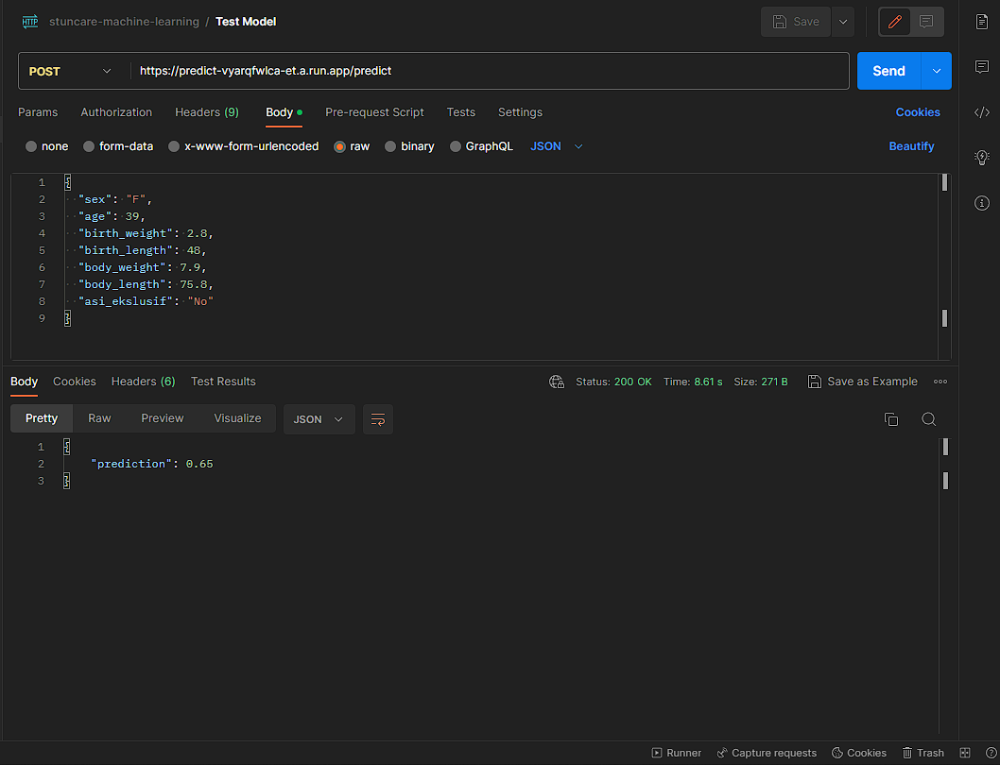

# StuntCare : Stunting Prediction in Children using DNN.
This repository contains a machine learning project that focuses on predicting stunting in children using a Deep Neural Network (DNN) model. Stunting refers to impaired growth and development in children, usually due to malnutrition or other factors. By leveraging machine learning techniques, we aim to develop an accurate predictive model that can assist in identifying children at risk of stunting.

## Introduction
Stunting is a significant public health concern, and early identification is crucial for timely intervention and prevention of long-term health issues. This project aims to build a machine learning model using a Deep Neural Network (DNN) to predict stunting in children based on various features such as age, gender, birth weight, birth length, body weight, body_length, breastfeeding, stunting.

## Dataset
The [dataset](https://www.kaggle.com/datasets/muhtarom/stunting-dataset) used for this project consists of anonymized records of children, including features such as age, gender, birth weight, birth length, body weight, body_length, breastfeeding, stunting.

## Requirements
To run this project, you need the following dependencies:
- Python
- TensorFlow
- NumPy
- Pandas
- Scikit-learn
- Flask
- You can install the required packages by running the following command: <code>pip install -r requirements.txt</code>

## Usage
1) Clone the repository: <code> git clone [https://github.com/C23-PS263-STUNT-CARE/Machine-Learning.git](https://github.com/C23-PS263-STUNT-CARE/Machine-Learning.git) </code>
2) Navigate to the project directory: <code>cd Machine-Learning </code>
3) Prepare your dataset and place it in the appropriate directory.
4) Modify the necessary parameters and settings in <code>main.py</code> and <code>preprocess.py</code> according to your requirements.
5) Run the preprocessing script to prepare your dataset: <code>python preprocess.py</code>. This script will preprocess your data and create the necessary input files for training and evaluation.
6) Run the main training script: <code>python main.py</code>. This script will train the model using the preprocessed data and save the trained model weights.
7) After training, you can evaluate the model using the evaluation script or make predictions on new data.

## Model Architecture
The DNN model architecture used in this project consists of several dense layers with ReLU activation, followed by a final output layer with a sigmoid activation function. The number of hidden layers and neurons can be customized through the configuration file.
<p align="center"></p>


## Training
The training process involves loading the dataset, preprocessing the data, splitting it into training and etest sets, and training the DNN model with BinaryCrossentropy loss function and also Adam Optimizer . The training script <code>main.py</code> implements this process and saves the trained model for future use.

## Evaluation
The evaluation loads the trained model and evaluates its performance on the test set. Various metrics such as accuracy, precision, recall, and F1 score are computed to assess the model's predictive capabilities.

## Results
The results obtained from the trained model on the test set are as follows:

- Accuracy: 0.96
- Precision: 0.95
- Recall: 0.94
- F1 Score: 0.94
- These metrics indicate a promising performance of the model in predicting stunting in children.

## Deployment to Google Cloud Platform
  Thanks to [patrickloeber](https://github.com/patrickloeber) for the How To Deploy ML Models With Google Cloud Run in [Youtube Video](https://www.youtube.com/watch?v=vieoHqt7pxo)
1) Setup Google Cloud Platform
    - Create a Project
    - Activate Cloud Run Api and Cloud Build API
    - And at least you have access to Cloud Run Admin
2) Setup Google Cloud SDK
    - You can follow the instructions here [https://cloud.google.com/sdk/docs/install](https://cloud.google.com/sdk/docs/install) to installation
    - Init your google cloud project in Google Cloud SDK
3) Create Dockerfile, requirements.txt, .dockerignore
4) Cloud Build and Deploy
    ```
    gcloud builds submit --tag gcr.io/<project_id>/<function_name>
    gcloud run deploy --image gcr.io/<project_id>/<function_name> --platform managed
    ```
5) Testing with Postman
    

## Contributing
Contributions to this project are welcome. If you want to contribute, please fork the repository, create a new branch, make your changes, and submit a pull request.

## License
This project is licensed by C23-P263 Team Bangkit Cohort 2023 Batch 1.
